# Base-ESP32S3-Simple-FOC-Verification-Board
The inductive brushless FOC test board based on ESP32S3 can run the speed loop/position loop/current loop. The software is written using arduino/idf.

The 2.1 version can only run the speed loop/position loop because the voltage output of ACS712 is not connected to the ADC of the MCU.

The 2.2 version of the development board downgraded the SD card from a four-wire SDIO to SPI, and the voltage output of ACS712 was connected to the ADC of the MCU. However, the problem it has is that the voltage output of ACS712 is not divided. The ADC pin is always at a voltage greater than 3.3V, and the ADC value is always output at full scale. Another problem it has is that the backlight of the LCD is connected in a common anode way, which is different from the LCD I purchased. Finally, the motor output enable of DRV8313 in version 2.2 is pulled up by default, and the MCU cannot control it, which may cause trouble. However, in any case, the board of version 2.1 successfully ran Simple FOC+LVGL and successfully implemented the speed loop/position loop/current loop.

The 2.3 version of the board has fixed the following issues: A new voltage divider resistor for ACS712 voltage sampling has been added, and the voltage divider ratio is set to 7.5/(22+7.5)≈0.254. The LCD backlight has been changed to a common cathode connection method. The buttons on the rotary encoder were removed and the motor enable pin of the DRV8313 was connected to the MCU.

As of now, the code platform is arduino. The involved libraries include <Arduino.h>,<SPI.h>,< wire-h >,<Adafruit_GFX.h>,<Adafruit_ST7735.h>,<SimpleFOC.h>,<Adafruit_NeoPixel.h>, and <freertos/Fre eRTOS.h>,<freertos/task.h>,<lvgl.h>. By taking advantage of the dual-core feature of ESP32S3, Simple FOC runs on core1, and LVGL and control logic run on core0, avoiding motor lag in bare-metal conditions.

Appearance and function display:
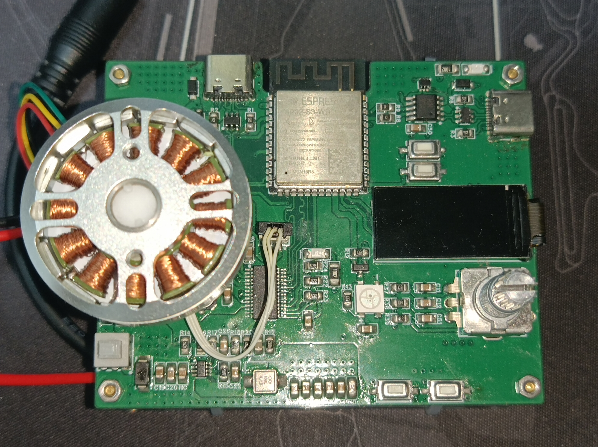
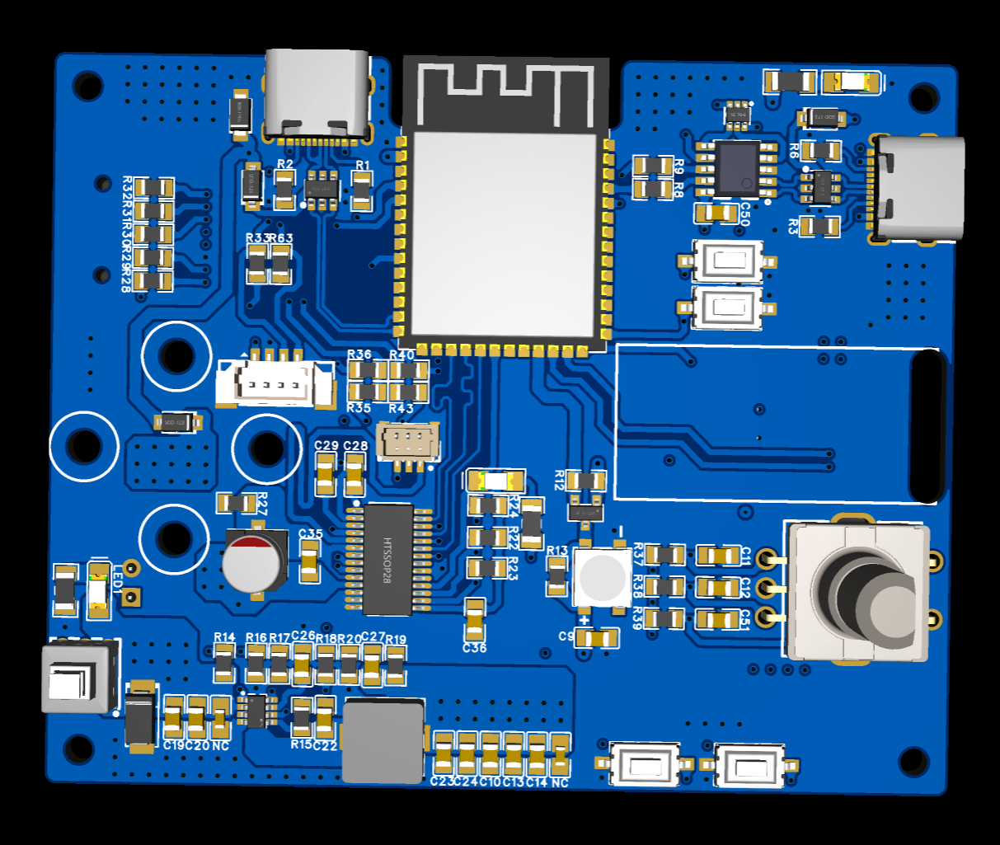
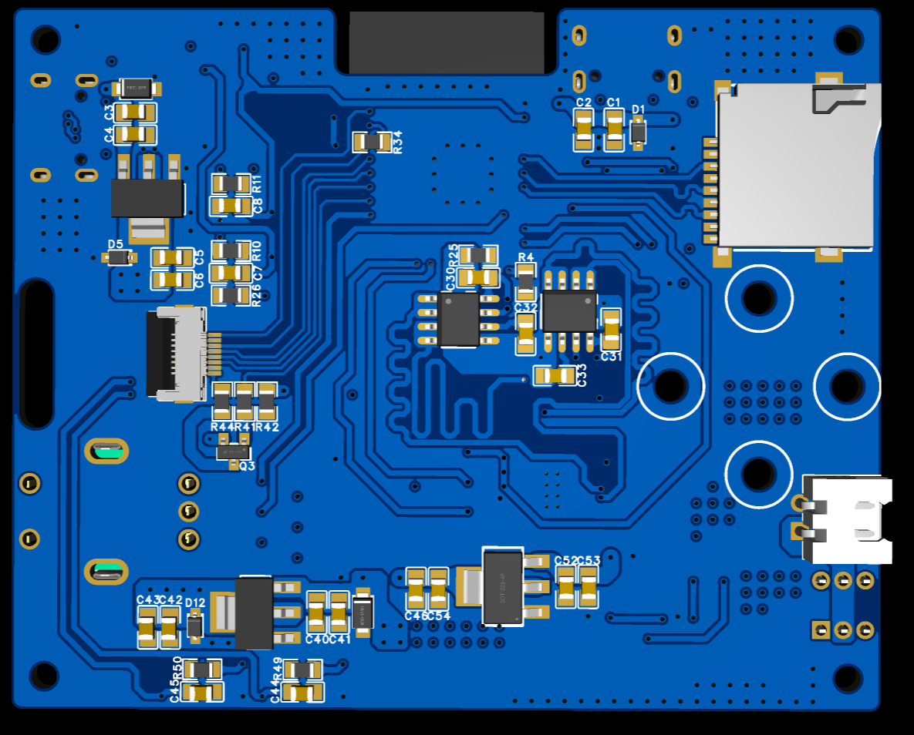
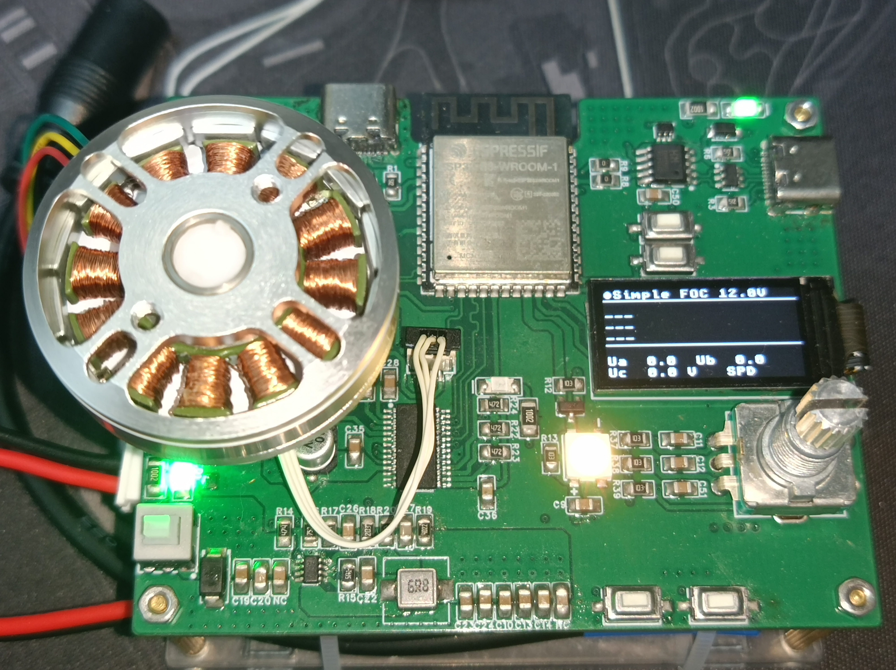
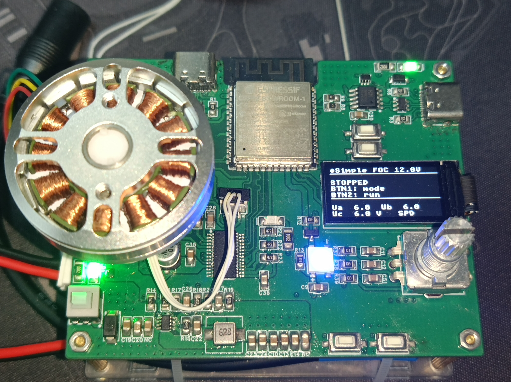
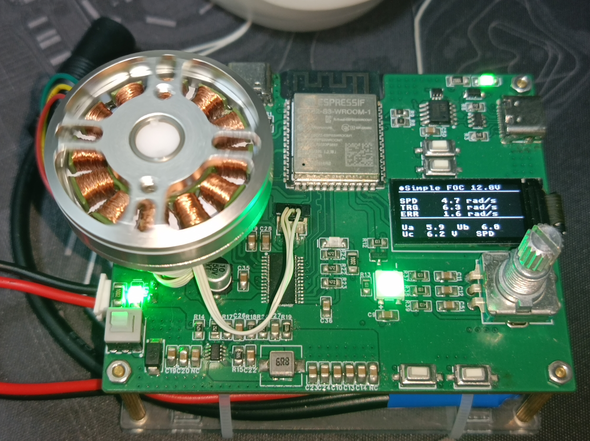
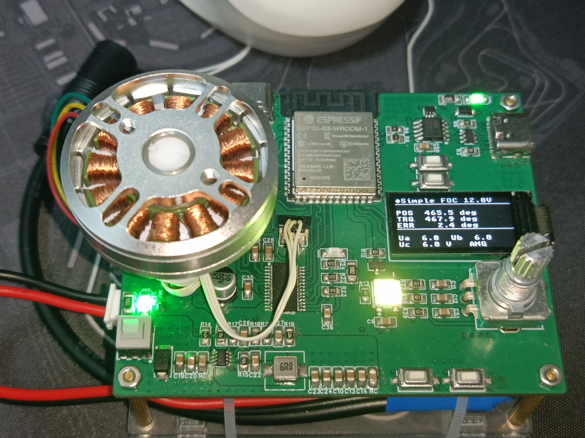
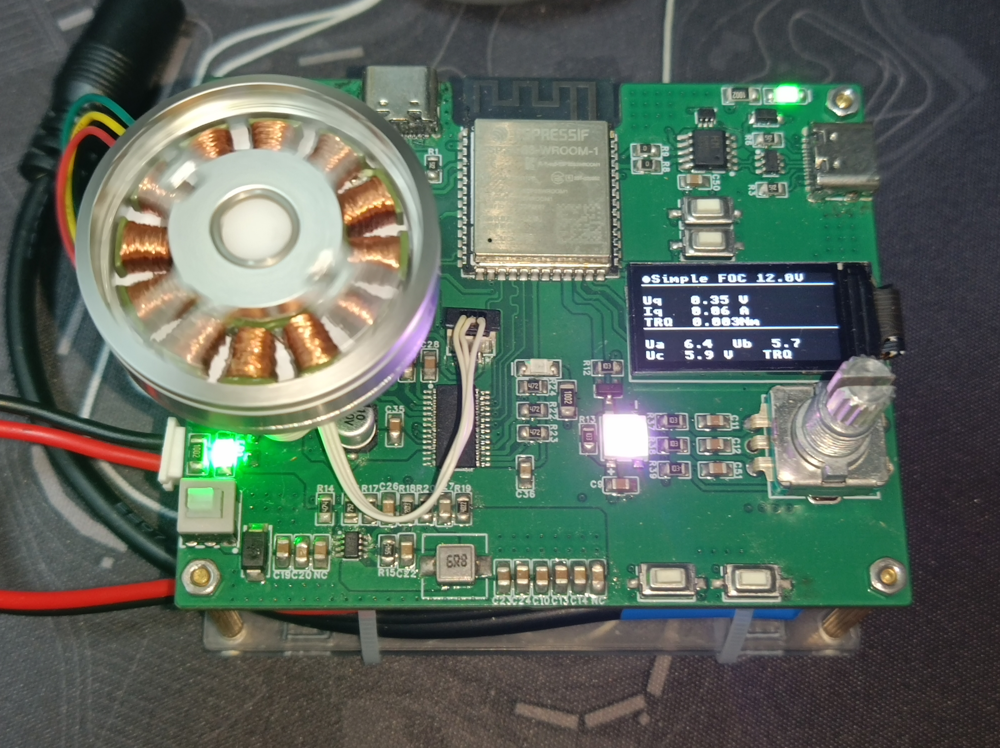

schematic、pcb(This can be found in the "hardware" folder)
schematic
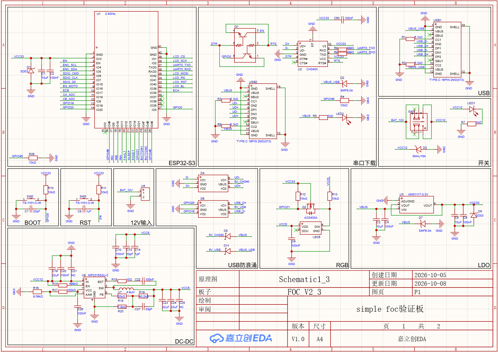
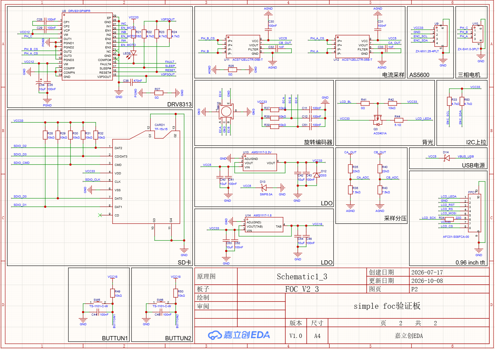
top layer
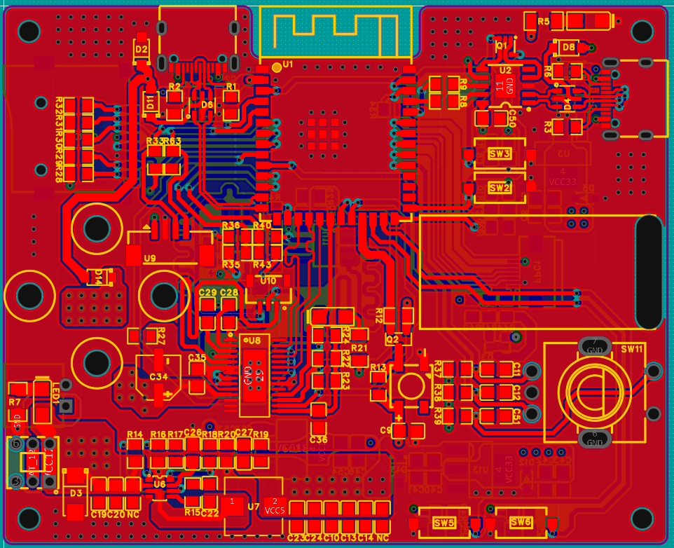
inner1 layer
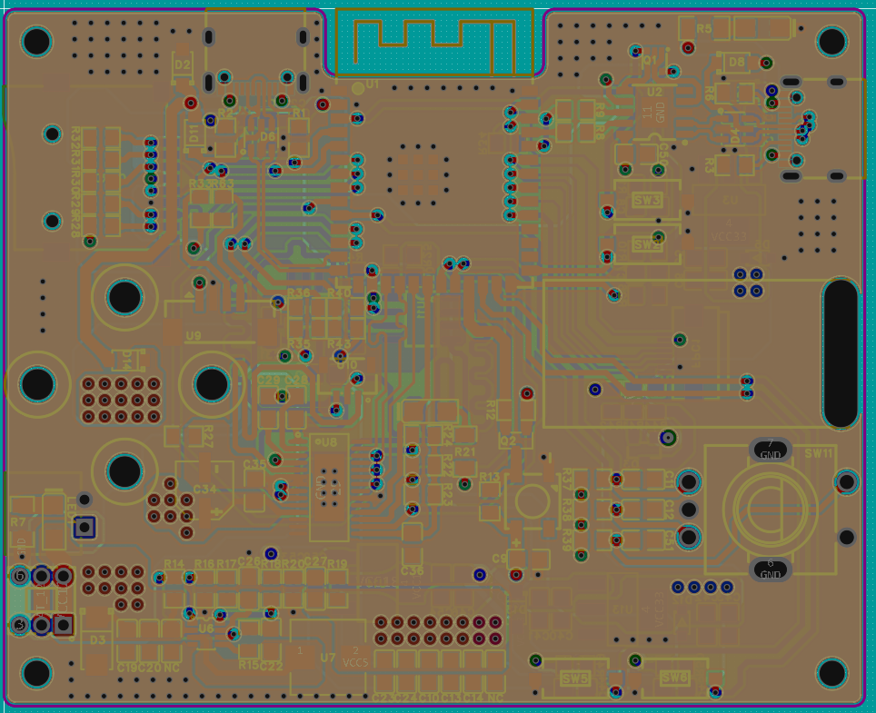
inner2 layer
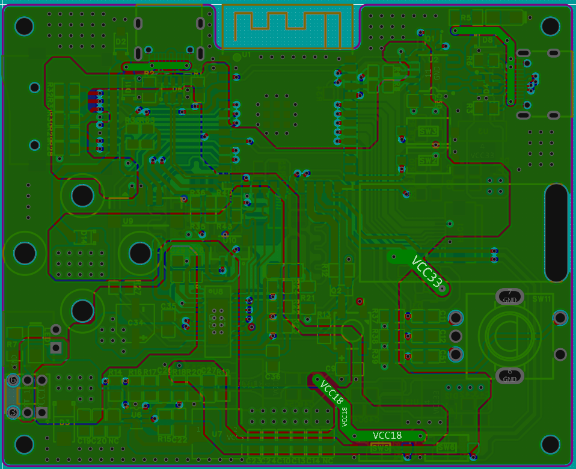
bottom layer
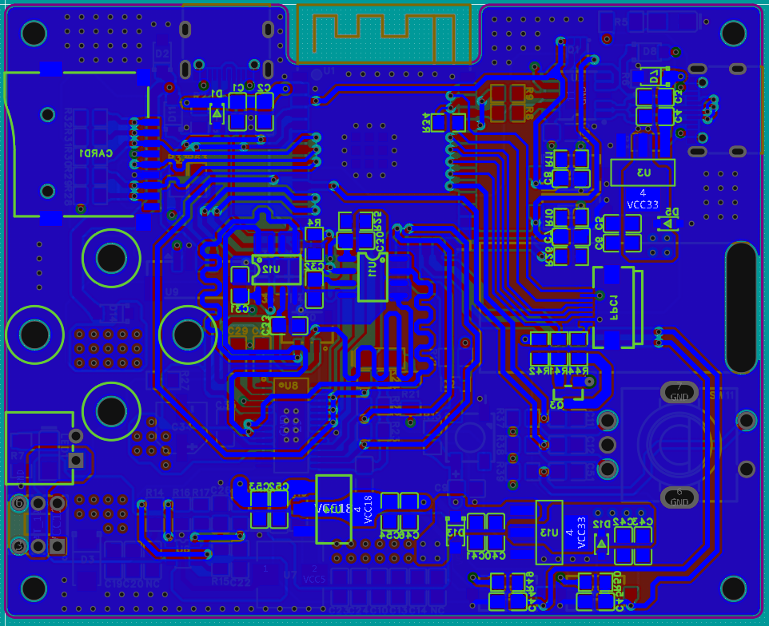